# Overflow 2022 Introductions
## Add Your Intro!
1. In the top right, click on the **Fork** button.
> A fork allows you to make a copy of this repository that you can edit, without affecting the original project.
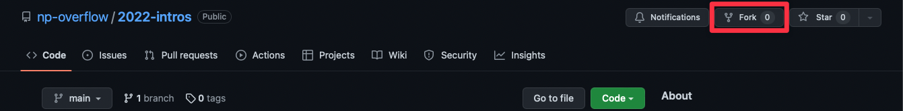

2. Ensure the owner is your account and select **Create fork**.
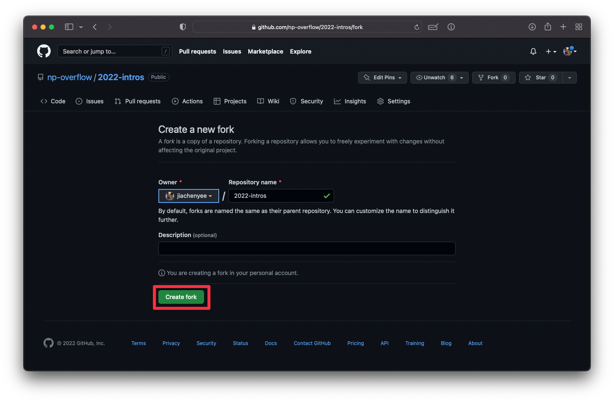

3. This is what your fork looks like.

### Web editor
1. Press the `.` key to open the web editor. This is basically Visual Studio Code in the web.
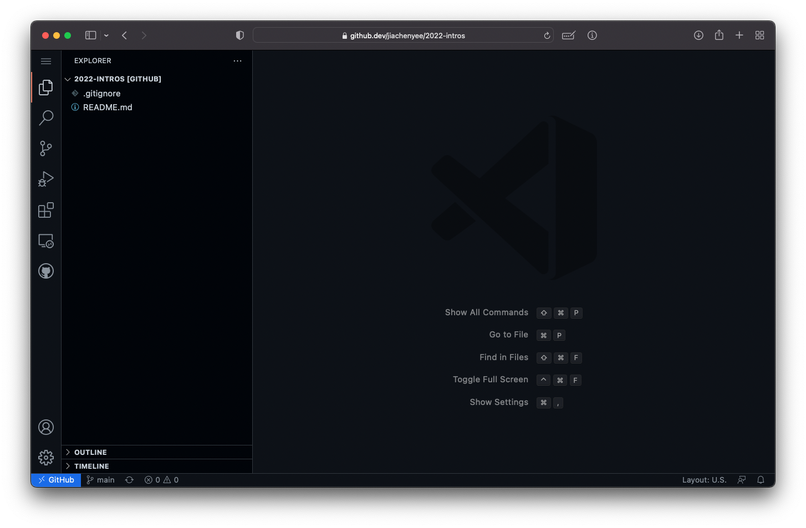

2. Create a new file by hovering over the repository name and clicking the `+` with a file icon.
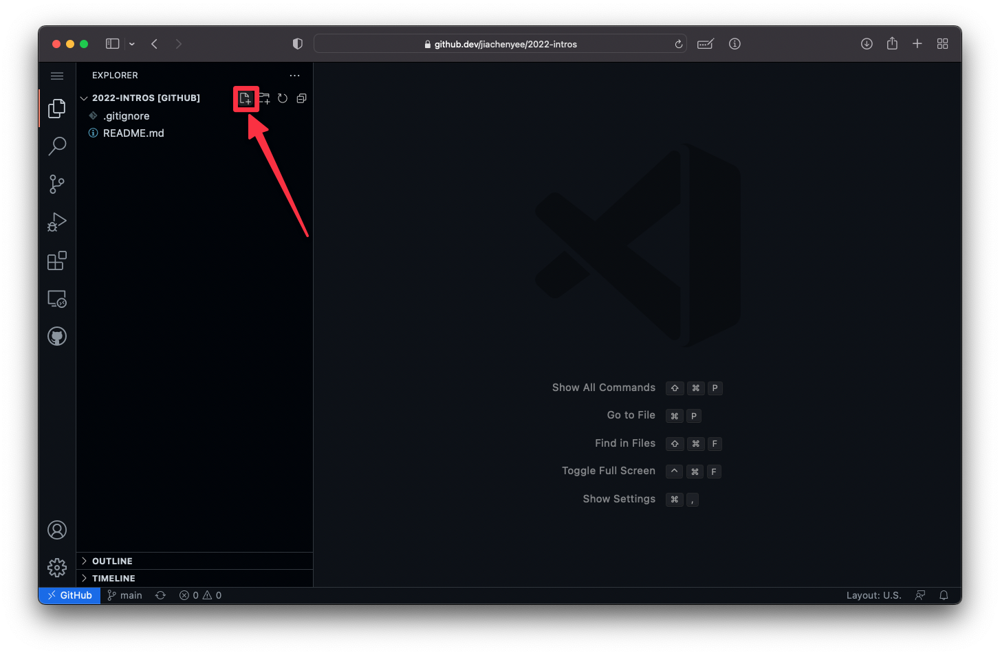

3. Name the file `YourName.md`. For example, `QinGuan.md`, `Jimmy.md`, `JiaChen.md`, `Ryan.md`.
> The `.md` stands for markdown. Markdown is a common file format used to write documentation and README files, like this one. [Learn more](https://en.wikipedia.org/wiki/Markdown).
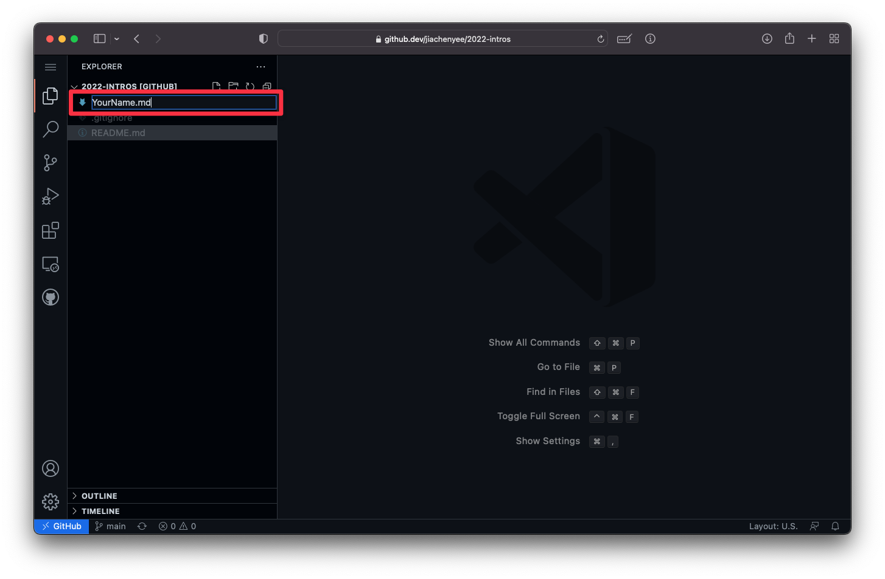

4. Introduce yourself! Type in your name, write a short bio, mention what programming languages you do, your favourite colour, and even add images!
> You can create rich Markdown files using the Markdown syntax. Here's a [guide](https://docs.github.com/en/get-started/writing-on-github/getting-started-with-writing-and-formatting-on-github/basic-writing-and-formatting-syntax).
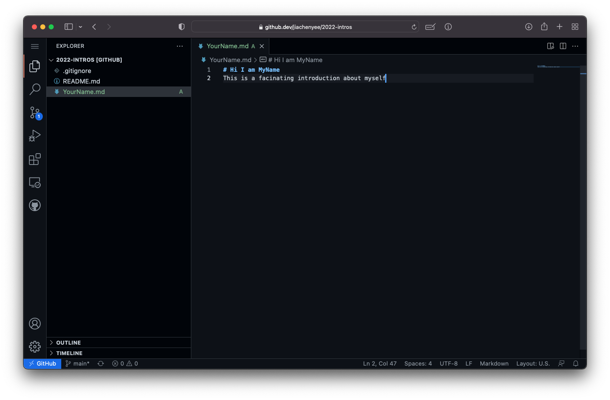

5. Once you're done, commit the change by going to the Source Control menu (the one that looks like a bunch of branches) and typing in a commit message.
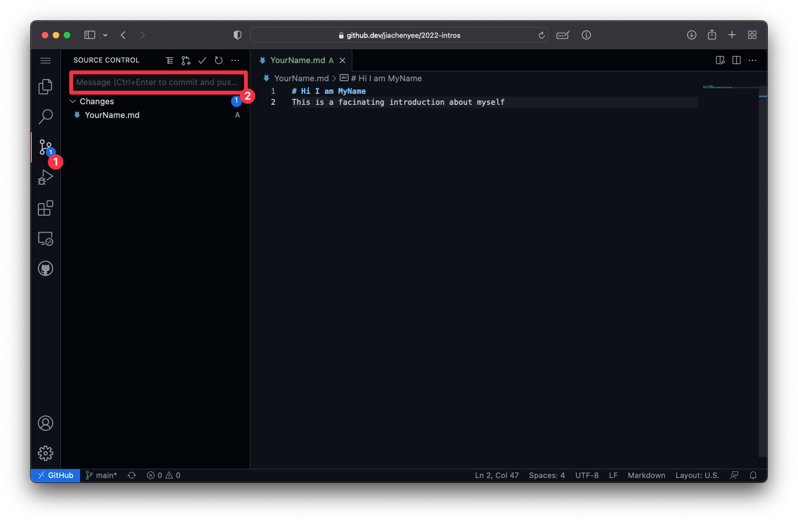

6. Click the checkmark to push
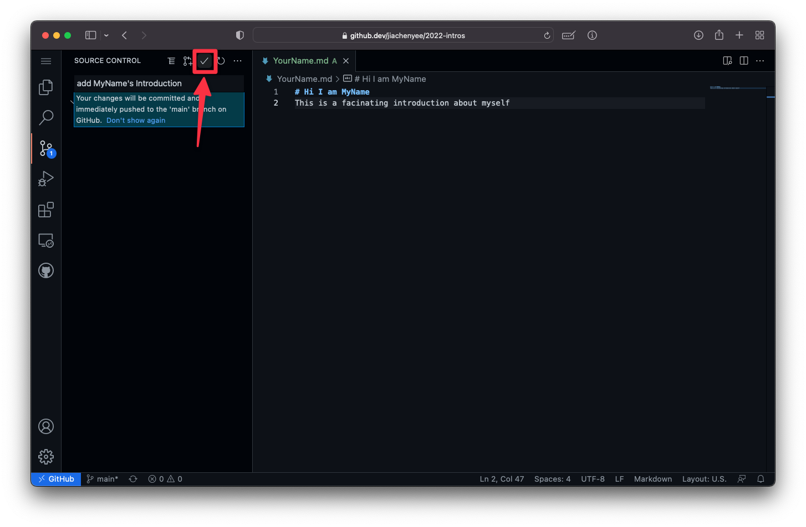

7. Go back to your repository on GitHub and the change should be there!
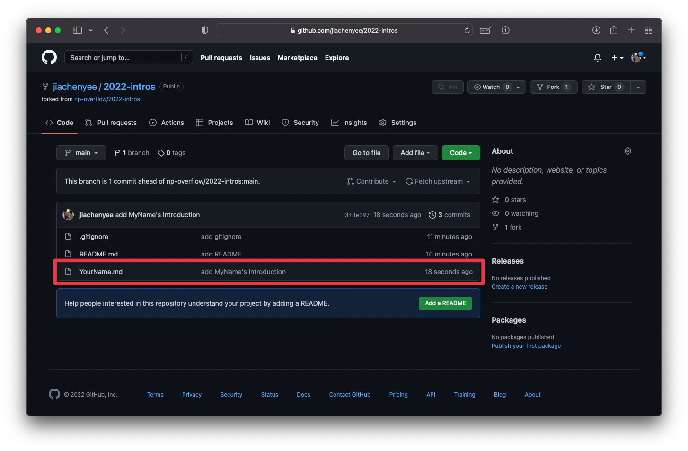

### Merging it back
1. Click on Contribute and select **Open pull request**.
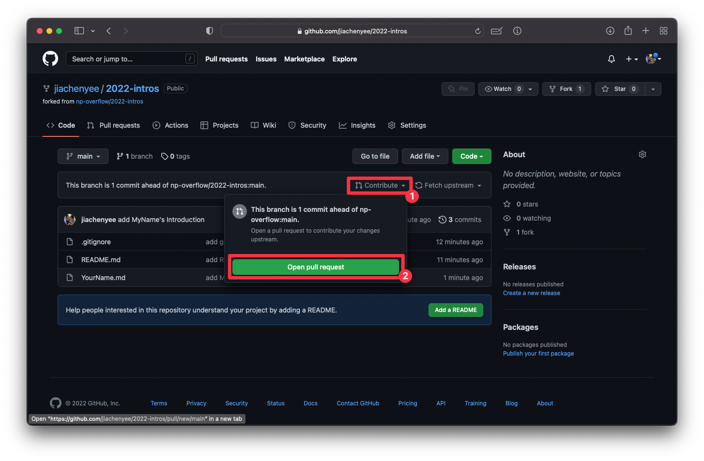

2. You will be able to compare the differences between the your copy and the copy in `np-overflow/2022-intros`. Click **Create pull request** when you're ready.
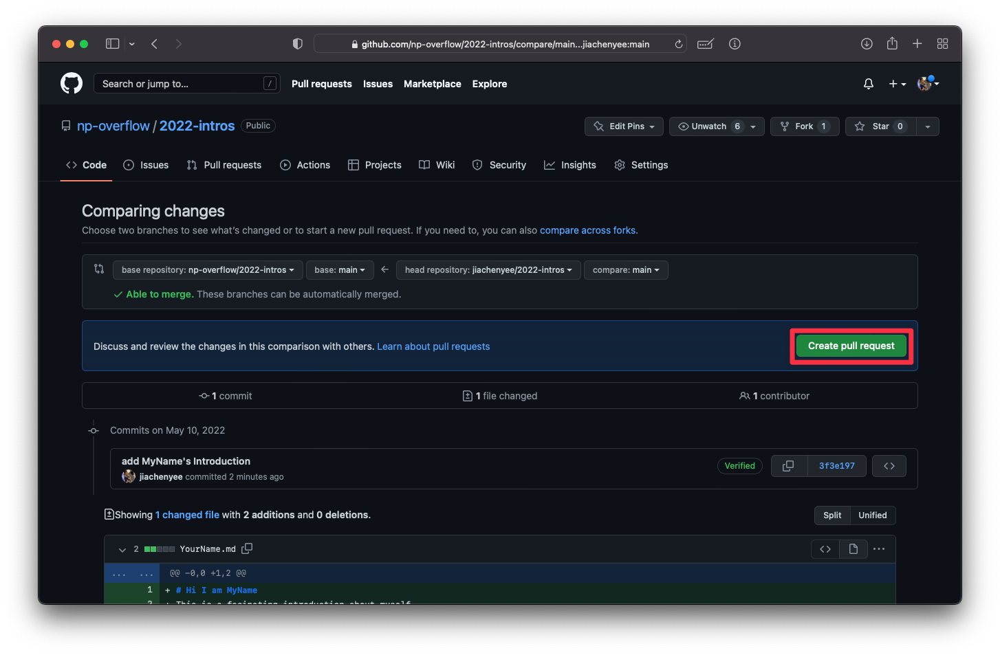

3. Add a title and a description and **Create pull request**
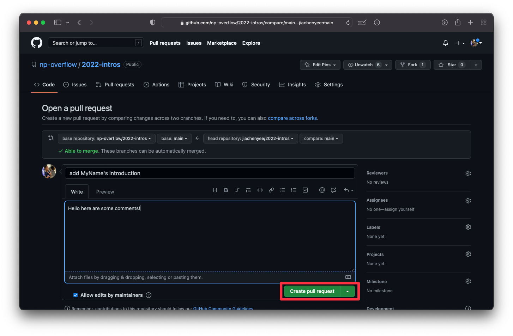

4. There's your PR!
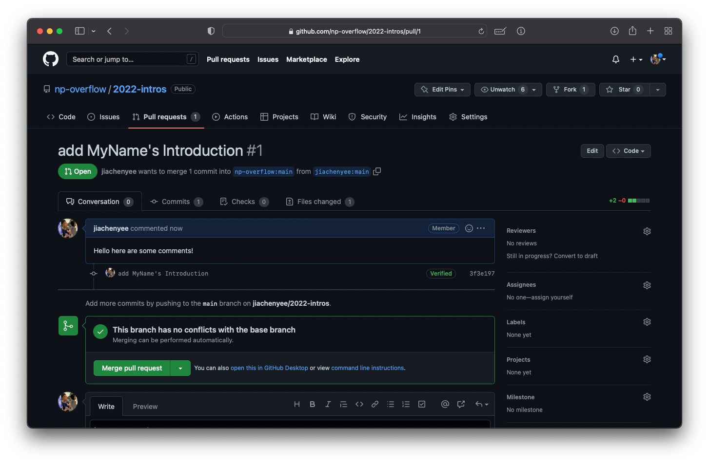

5. All that's left is to wait for a reviewer to review it and merge it into the project!